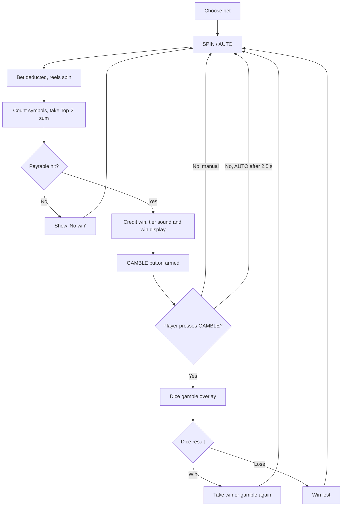

# 🐺🦇 SHADOW PACK — Game Design Document

> **4 symbols · Top-2 sum evaluation · 4×5 screen · RTP 96.00%**
> A single-file HTML slot with a "count the two most frequent symbols" mechanic, a dice-based gamble feature, tiered win celebrations and a full Monte Carlo verification of the maths.

---

## Table of contents

1. [Overview](#1-overview)
2. [Core mechanic](#2-core-mechanic)
3. [Paytable](#3-paytable)
4. [Mathematical model](#4-mathematical-model)
5. [Simulation results (500,000,000 spins)](#5-simulation-results-500000000-spins)
6. [Bankroll survival analysis](#6-bankroll-survival-analysis)
7. [Gamble feature](#7-gamble-feature)
8. [Win tiers, presentation and audio](#8-win-tiers-presentation-and-audio)
9. [Game flow and UI](#9-game-flow-and-ui)
10. [Persistence](#10-persistence)
11. [RNG](#11-rng)
12. [Project files and how to run](#12-project-files-and-how-to-run)
13. [Design notes and possible improvements](#13-design-notes-and-possible-improvements)

---

## 1. Overview

| Property | Value |
|---|---|
| Title | Shadow Pack (simulation name: *Darkness – 4 Symbols (Top-2 Sum)*) |
| Platform | Browser (single `Shadow_Pack.html`, no dependencies) |
| Screen | 5 reels × 4 rows = **20 cells** |
| Symbols | 🐺 Wolf · 🐦‍⬛ Raven · 🦇 Bat · 🕷️ Spider |
| Symbol weights | 5 / 5 / 5 / 5 (each cell: 25 % per symbol, independent) |
| Win evaluation | Sum of the two most frequent symbols on the screen |
| Theoretical RTP | **95.9990 %** (house edge 4.0010 %) |
| Hit frequency | **31.97 %** (1 in 3.13), of which 18.98 % are 1× "push" wins |
| Max win | **1,000× total bet** (probability 1 in 174,763) |
| Volatility index (σ/µ) | **5.55** (σ = 5.3243 per 1× bet) |
| Bets | 0.4 · 1 · 2 · 4 · 10 · 20 · 40 · 100 · 250 · 500 · 1000 |
| Starting balance | 200,000 credits |
| Extras | Dice gamble, AUTO play, tiered fanfares, confetti, save/export/import |

---

## 2. Core mechanic

There are no paylines and no scatters. After every spin the game:

1. Counts how many times each of the 4 symbols appears on the 20 visible cells.
2. Takes the **two highest counts** and adds them together (the *Top-2 sum*).
3. Looks the sum up in the paytable and pays `multiplier × bet`.

Example from the UI: `🐺 × 7 + 🦇 × 6 = 13` → sum 13 → no win.

Because the four counts always add up to 20, the Top-2 sum ranges from **10** (5-5-5-5, perfectly even) to **20** (all cells use only two symbols). A high sum means the screen is dominated by two symbols; sum 10 is the rarest "perfectly balanced" screen and is paid as a special low-end win.

---

## 3. Paytable

| Top-2 sum | Payout (× bet) | Probability | 1 in | RTP contribution | Share of RTP |
|---:|---:|---:|---:|---:|---:|
| 10 | 12 | 1.067087 % | 93.7 | 12.8050 % | 13.34 % |
| 11 | – | 10.670869 % | 9.4 | – | – |
| 12 | – | 28.053377 % | 3.6 | – | – |
| 13 | – | 29.302546 % | 3.4 | – | – |
| 14 | 1 | 18.976300 % | 5.3 | 18.9763 % | 19.77 % |
| 15 | 2.5 | 8.424070 % | 11.9 | 21.0602 % | 21.94 % |
| 16 | 7 | 2.734619 % | 36.6 | 19.1423 % | 19.94 % |
| 17 | 20 | 0.650442 % | 153.7 | 13.0088 % | 13.55 % |
| 18 | 60 | 0.108674 % | 920.2 | 6.5204 % | 6.79 % |
| 19 | 342 | 0.011444 % | 8,738.5 | 3.9137 % | 4.08 % |
| 20 | 1,000 | 0.000572 % | 174,762.9 | 0.5722 % | 0.60 % |
| | | | **Total RTP** | **95.9990 %** | **100 %** |

Sums 11, 12 and 13 together make up **68.03 %** of all spins and never pay.

> Note: a 1× win (sum 14) only returns the stake. Real profitable spins (sums 10, 15–20) occur **12.997 %** of the time (about 1 in 7.7).

---

## 4. Mathematical model

Each of the 20 cells is an independent draw with `P(symbol) = 0.25`. The vector of symbol counts therefore follows a **multinomial distribution**:

```
P(n1, n2, n3, n4) = 20! / (n1! · n2! · n3! · n4!) · 0.25^20      with n1+n2+n3+n4 = 20
```

There are **1,771** possible count-vectors (compositions of 20 into 4 non-negative parts). For each vector, the counts are sorted descending and the two largest are added. Summing the probabilities per sum gives the exact distribution above (total probability check = 1.0000000000).

```
RTP = Σ  P(sum) × Payout(sum)  = 0.95999047
```

The Python script (`SHADOW_PACK.py`) computes this exactly and then verifies it by Monte Carlo simulation.

The browser game uses the same model: each cell is drawn independently and uniformly from the four symbols. The long strip of random symbols that scrolls during the reel animation is purely visual and does not influence the result.

---

## 5. Simulation results (500,000,000 spins)

Bet 1 credit, 500,000,000 spins, 1,360 s (≈ 367,600 spins/s).

### 5.1 RTP check

| | Value |
|---|---:|
| Theoretical RTP | 95.9990 % |
| Simulated RTP | **95.9771 %** |
| Difference | −0.0219 pp |
| Standard error of the mean (σ/√N) | ≈ 0.0238 pp |

The deviation is **under one standard error**, i.e. fully consistent with the theoretical value.

### 5.2 Totals

| | Value |
|---|---:|
| Total bet | 500,000,000 |
| Total won | 479,885,607 |
| Company profit | 20,114,393 (house edge 4.02 %) |
| Zero-win spins | 340,156,893 (68.03 %) |
| Winning spins | 159,843,107 (31.97 %) |
| Max single win | 1,000× |

### 5.3 Simulated vs theoretical sum distribution

| Sum | Payout | Sim count | Sim % | Theory % | 1 in (sim) |
|---:|---:|---:|---:|---:|---:|
| 10 | 12× | 5,335,559 | 1.067112 % | 1.067087 % | 93.7 |
| 11 | – | 53,355,779 | 10.671156 % | 10.670869 % | 9.4 |
| 12 | – | 140,257,247 | 28.051449 % | 28.053377 % | 3.6 |
| 13 | – | 146,543,867 | 29.308773 % | 29.302546 % | 3.4 |
| 14 | 1× | 94,865,619 | 18.973124 % | 18.976300 % | 5.3 |
| 15 | 2.5× | 42,113,922 | 8.422784 % | 8.424070 % | 11.9 |
| 16 | 7× | 13,675,791 | 2.735158 % | 2.734619 % | 36.6 |
| 17 | 20× | 3,249,409 | 0.649882 % | 0.650442 % | 153.9 |
| 18 | 60× | 542,864 | 0.108573 % | 0.108674 % | 921.0 |
| 19 | 342× | 57,029 | 0.011406 % | 0.011444 % | 8,767.5 |
| 20 | 1,000× | 2,914 | 0.000583 % | 0.000572 % | 171,585.4 |

All differences are below 0.01 percentage points.

### 5.4 Win-size distribution

| Win range | Spins | Share | 1 in |
|---|---:|---:|---:|
| 0× | 340,156,893 | 68.031 % | 1.5 |
| 0–1× (exactly 1×) | 94,865,619 | 18.973 % | 5.3 |
| 1–5× | 42,113,922 | 8.423 % | 11.9 |
| 5–20× | 22,260,759 | 4.452 % | 22.5 |
| 20–50× | 0 | 0 % | – |
| 50–100× | 542,864 | 0.109 % | 921 |
| 100–500× | 57,029 | 0.011 % | 8,767 |
| 500–1000× | 2,914 | 0.001 % | 171,585 |

*(No payout exists between 20× and 60×, hence the empty 20–50× bin; 1,000× is the cap.)*

### 5.5 Per-spin percentiles

| Percentile | Win (× bet) |
|---|---:|
| P0 – P50 | 0 |
| P75 | 1.0 |
| P90 | 2.5 |
| Max | 1,000 |

### 5.6 Volatility and streaks

| Metric | Value |
|---|---:|
| Mean (µ) | 0.9598 |
| Standard deviation (σ) | 5.3243 |
| Volatility index (σ/µ) | 5.5475 |
| Total win streaks / max length | 108,741,997 / **17** |
| Total loss streaks / max length | 108,741,638 / **47** |

---

## 6. Bankroll survival analysis

1,000 simulated players, each starting with **100 credits**, betting **1 credit** per spin, up to 100,000 spins. A player is busted when balance < 1.

| Spins | Alive | Busted | Survival | Min | Median | Max |
|---:|---:|---:|---:|---:|---:|---:|
| 100 | 1,000 | 0 | 100.00 % | 27.00 | 86.75 | 487.00 |
| 300 | 918 | 82 | 91.80 % | 1.00 | 79.00 | 1,027.50 |
| 500 | 706 | 294 | 70.60 % | 1.00 | 86.00 | 1,076.00 |
| 1,000 | 416 | 584 | 41.60 % | 3.50 | 119.25 | 1,486.00 |
| 2,000 | 234 | 766 | 23.40 % | 1.50 | 161.00 | 1,391.50 |
| 2,500 | 193 | 807 | 19.30 % | 2.50 | 215.00 | 1,590.50 |
| 5,000 | 102 | 898 | 10.20 % | 4.50 | 307.50 | 1,980.00 |
| 10,000 | 47 | 953 | 4.70 % | 24.50 | 593.50 | 2,023.50 |
| 25,000 | 19 | 981 | 1.90 % | 82.00 | 712.00 | 2,109.00 |
| 50,000 | 5 | 995 | 0.50 % | 497.00 | 1,523.50 | 2,572.00 |
| 100,000 | 1 | 999 | 0.10 % | 1,458.00 | 1,458.00 | 1,458.00 |

Interpretation: with a 4 % house edge the long-run drift is negative, but the high volatility means that surviving players' median balance *rises* over time (survivorship effect) while most players eventually go bust.

---

## 7. Gamble feature

After any winning spin the player may risk the win on a six-sided die.

### 7.1 Rules

- The whole current win is staked. The button shows the amount.
- The player chooses one bet type, then presses **SPIN DICE**:

| Bet | Wins on | Multiplier | Win chance | Return |
|---|---|---:|---:|---:|
| 🔵 SMALL | 1, 2, 3 | ×2 | 1/2 | 100 % |
| 🔴 BIG | 4, 5, 6 | ×2 | 1/2 | 100 % |
| 🟢 EVEN | 2, 4, 6 | ×2 | 1/2 | 100 % |
| 🟡 ODD | 1, 3, 5 | ×2 | 1/2 | 100 % |
| 🟣 Pick 1 number | chosen | ×6 | 1/6 | 100 % |
| 🟣 Pick 2 numbers | either | ×3 | 2/6 | 100 % |
| 🟣 Pick 3 numbers | any | ×2 | 3/6 | 100 % |
| 🟣 Pick 4 numbers | any | ×1.5 | 4/6 | 100 % |
| 🟣 Pick 5 numbers | any | ×1.2 | 5/6 | 100 % |
| 🟣 Pick 6 numbers | any | ×1 | 6/6 | 100 % |

- **Win:** the staked amount is multiplied; the player can take it (**TAKE WIN**) or gamble again.
- **Lose:** the staked win is lost and the overlay closes automatically.
- Every option is mathematically **fair (RTP 100 %)**, so the gamble never changes the overall RTP of the game, only its variance.
- The balance is credited when the win is taken. While the overlay is open, spinning, AUTO, bet change and New Game are blocked.

### 7.2 Gamble button placement and timing

- The **GAMBLE** button lives in the top HUD, between **Cycles** and **Session RTP**.
- It becomes available as soon as the win display has faded out.
- **Manual mode:** it stays available until the next spin.
- **AUTO mode:** the game waits **2.5 seconds** after the win display hides. A countdown bar under the button shows the remaining time. If the player opens the gamble, AUTO pauses until it is closed; otherwise AUTO continues and the win stays credited. Pressing STOP cancels the wait and keeps the button available.
- The window length is the constant `GAMBLE_WINDOW_MS` (2500) in the source.

---

## 8. Win tiers, presentation and audio

Tier is derived from the payout multiplier of the spin.

| Tier | Multiplier | Payouts | Label | Display time | Sound and effects |
|---:|---|---|---|---:|---|
| 0 | < 2× | 1× | – | 2.0 s | Soft two-note coin ping |
| 1 | 2× – < 5× | 2.5× | – | 2.0 s | Bright 4-note arpeggio with bell tones and a few coins |
| 2 | 5× – < 15× | 7×, 12× | – | 2.2 s | Long rising arpeggio, soft brass chord, bells, coin sprinkle |
| 3 | 15× – < 40× | 20× | **BIG WIN** | 3.0 s | Short brass fanfare, timpani, cymbal, coin shower, screen shake, confetti |
| 4 | 40× – < 200× | 60× | **MEGA WIN** | 4.2 s | Snare roll, full fanfare, cymbal crash, bigger coin shower, pulse animation |
| 5 | 200× – < 600× | 342× | **SUPER MEGA WIN** | 6.0 s | Two fanfare phrases (second one a whole tone higher), timpani, choir-like pad |
| 6 | ≥ 600× | 1,000× | **👑 JACKPOT 👑** | 8.5 s | Three rising fanfare phrases, timpani hits, huge finale, continuous coin rain |

Details:

- From tier 3 the win amount **counts up** and a coin/confetti fountain is fired from the bottom corners (plus rain from the top from tier 4).
- Background music is ducked during fanfares and restored afterwards.
- Fanfares use a synthesised brass voice (detuned sawtooth oscillators with a filter envelope), a small convolution reverb and a compressor on the SFX bus, all generated with the Web Audio API — **no audio files are required**.
- Gamble wins reuse the tier sounds (capped at the short BIG WIN fanfare); the dice roll has a rattle sound and a losing roll plays a descending tone.

---

## 9. Game flow and UI



**HUD:** Credits · Bet · Spins (x/100) · Cycles · **Gamble** · Session RTP (green ≥ 100 %, yellow ≥ 90 %, red below).

**Controls:** Sound on/off · SPIN · AUTO · STOP · Save · Export · Import · New game (with confirmation).

**Bet row:** 0.4 · 1 · 2 · 4 · 10 · 20 · 40 · 100 · 250 · 500 · 1000.

**Cycles:** every 100 spins the spin counter resets and the cycle counter increases.

**Blocking rules:** while a BIG WIN or higher is being shown, or while the gamble is open, bets cannot be changed, a new game cannot be started and a new spin is refused.

**Audio ambience:** looping synthesised background track (134 BPM), UI clicks, reel-stop sounds, a low-balance warning, and random bat-screech / wolf-howl stingers after several losses in a row.

---

## 10. Persistence

- Auto-saved to `localStorage` (key `shadowPackSave`) after each spin and when the page is closed.
- **Export** downloads a JSON save (`gameVersion: "shadow_pack_v1"`); **Import** restores it.
- Saved fields: balance, bet, spin count, cycle count, gamble statistics (sessions, total win, total loss), session total bet and total won.
- **New game** resets everything to 200,000 credits, bet 1.

---

## 11. RNG

- Each random value mixes the browser's `crypto.getRandomValues` with `Math.random` (`(crypto + Math.random) mod 1`), giving a uniform value in [0, 1).
- Symbols are drawn per cell from a 20-entry reel (5 entries per symbol), which is equivalent to a uniform 25 % draw.
- The gamble die uses the same RNG (`1…6`, uniform).

> The game is a simulation/entertainment project with virtual credits only. It is not certified for real-money use.

---

## 12. Project files and how to run

| File | Purpose |
|---|---|
| `Shadow_Pack.html` | The complete game. Open it in any modern browser. |
| `SHADOW_PACK.py` | Exact multinomial analysis plus Monte Carlo, streaks, volatility and survival simulation. |
| `SHADOW_PACK_GDD.md` | This document. |

### Run the game

Open `Shadow_Pack.html` in a browser. Audio starts after the first click or spin (browser autoplay policy).

### Run the maths simulation

```bash
pip install numpy
python SHADOW_PACK.py
```

The script prints the theoretical distribution and RTP, then asks for the number of iterations and the bet. The reported run used 500,000,000 spins in chunks of 500,000, followed by the survival analysis (1,000 players × 100,000 spins). A shorter run (for example 10,000,000 spins) is enough to see the RTP converge to about 96 %.

---

## 13. Design notes and possible improvements

- **Sum 10 pays 12×.** It is the only payout on the low end of the scale and contributes 13.3 % of the RTP. It is a deliberate "perfectly balanced screen" bonus; it can be tuned independently of the high-sum payouts.
- **1× is a push.** 18.98 % of spins return exactly the bet; they count as hits but are not profit. If "hit frequency" is used in marketing material, the profitable hit rate is 13.0 %.
- **Payout gap 20× → 60×.** No win lands between 20× and 60×. An intermediate value would smooth the curve.
- **Rare top prizes.** 342× (1 in 8,739) and 1,000× (1 in 174,763) together give 4.7 % of the RTP, so the volatility index of 5.55 is driven largely by the tail.
- **Gamble limits.** The gamble currently has no cap on consecutive rounds or maximum stake. Many regulated markets limit this (for example to 5 rounds or a maximum win). A cap can be added in `spinDice()`.
- **Gamble statistics.** "Total loss" counts the original win that was risked, not any higher amount reached through consecutive wins.
- **Possible extensions:** free-spin trigger on very high sums, a bonus buy, additional bet-dependent jackpots, and a language switch (EN/BG).

---

*Verified against: `SHADOW_PACK.py` output (500,000,000 spins) and `Shadow_Pack.html`.*
